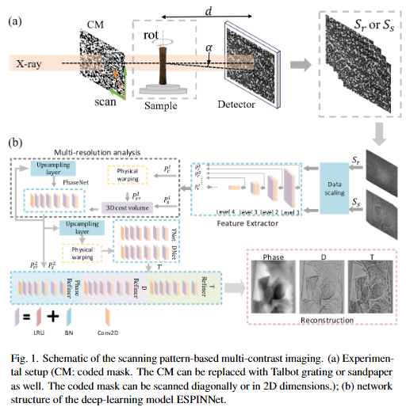

# Enhanced Scanning Pattern-based Imaging Neural Network: ESPINNet

This repository contains an Enhanced Scanning Pattern-based Imaging Neural Network (ESPINNet) for grating interferometry and speckle tracking methods, which is based on a multi-resolution analysis of convolutional neural networks and can extract multi-contrast information including transmission, phase and dark-field.


## Network structure


## Installation
Use the environment.yml file to create the conda environment to run this code.
```
conda env create -f environment.yml
```
## Examples

- 'estimate_single.py': inference example script.
- 'T 
Please cite this work when using this network!